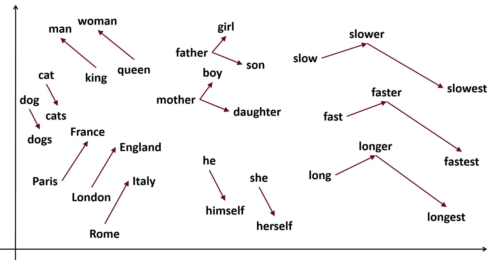

# News Classification Using Gensim Word Vectors

This Jupyter Notebook provides a demonstration of news classification using Gensim Word2Vec Embeddings. The project aims to classify news articles into predefined categories based on their content. The classification model utilizes pre-trained word vectors provided by Gensim, a popular library for natural language processing tasks.


## Dataset
The dataset used in this project consists of news articles categorized into different topics such as politics, sports, technology, etc. Each article is represented as a text document along with its corresponding category label.


## Screenshots
#### Word2Vec Visualization


### Word2Vec
Word2Vec: Capturing Semantic Meaning in Words

Word2Vec is a groundbreaking technique in natural language processing (NLP) that aims to capture the semantic meaning of words by representing them as dense, high-dimensional vectors. Developed by researchers at Google in 2013, Word2Vec has revolutionized various NLP tasks by enabling algorithms to understand and process textual data in a more nuanced and contextually rich manner.

At its core, Word2Vec operates on the principle of distributional semantics, which posits that words appearing in similar contexts tend to have similar meanings. Leveraging large text corpora, Word2Vec learns to map words to continuous vector representations in such a way that words with similar meanings are closer together in the vector space. This process is achieved through the training of neural network architectures, typically either the Continuous Bag of Words (CBOW) or Skip-gram models.

Continuous Bag of Words (CBOW): In this model, the goal is to predict the target word based on its surrounding context words. CBOW is effective when dealing with frequent words and is known for its faster training times.

Skip-gram: Unlike CBOW, the Skip-gram model predicts the context words (surrounding words) given a target word. Despite being slower to train compared to CBOW, Skip-gram often performs better with infrequent words and captures more subtle semantic relationships.

Once trained, the Word2Vec model generates dense word embeddings, where each word is represented by a fixed-length vector of real numbers. These embeddings capture semantic similarities and relationships between words, enabling downstream NLP tasks such as sentiment analysis, named entity recognition, machine translation, and document classification to benefit from richer contextual understanding.


## Installation

Ensure you have Python installed on your system. Then clone this repository:

```bash
  git clone [repository-link]
  cd [repository-directory]
```

Install the required packages:

```bash
pip install jupyter gensim numpy pandas scikit-learn matplotlib nltk
```

## Usage/Examples

To run the flask app:
```cmd
cd your-repository
jupyter notebook
```
- Open the News_classification_using_Gensim_word_vectors.ipynb notebook in your browser.
- Follow the instructions provided in the notebook to execute the code cells and analyze the results.